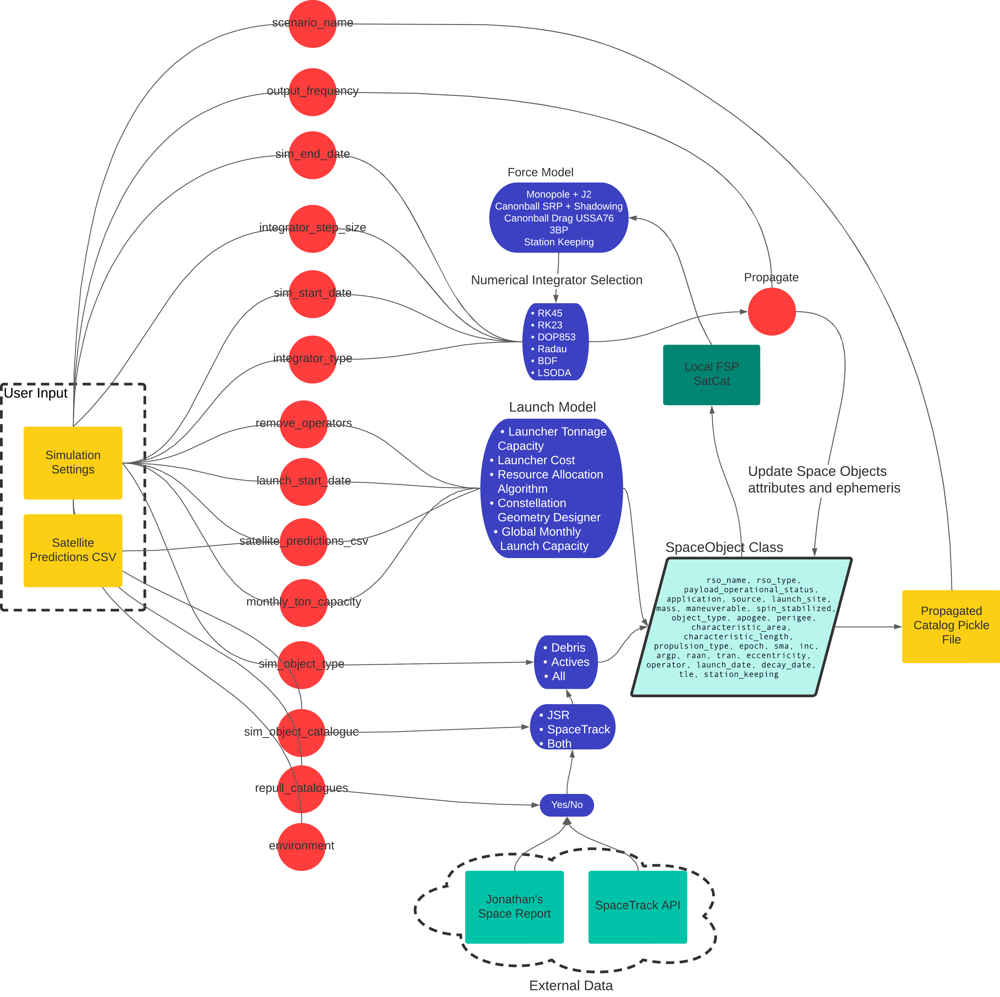

# 🚀FSP Simulator

Welcome to the Python version of the Future Space Populations Simulator! This modern adaptation provides an updated approach to running source-sink evolutionary simulations of objects in space. The simulator is designed to be modular, allowing for easy integration of new models and features. We hope that this will allow for the simulator to be used as a tool for the community to test new ideas and models. If you have feedback, would like to get involved please feel free submit a pull request or raise an issue. As a "v0.1" there are a number of features under development and we are open to collaboration on many of these.

## 🏁 Getting Started

Each new simulation you wish to run should be configured by creating a new `.json` file and putting in the following directory `src/data/specify_simulation`.

When executing `main.py`, it will automatically run all the simulations as per the settings in the respective `.json` files.

## 📝 JSON Configuration Structure

A typical simulation configuration can be represented in the JSON file format as follows:

```json
{
  "scenario_name": "testrun",
  "monthly_ton_capacity": "100",
  "launch_start_date":"2019-01-01",
  "remove_operators": "E-Space",
  "sim_start_date":"2019-01-01",
  "sim_end_date":"2019-01-08",
  "output_frequency": 360,
  "integrator_step_size": 20,
  "integrator_type": "RK45",
  "sim_object_type": "all",
  "sim_object_catalogue" : "both",
  "environment": "development",
  "repull_catalogues": false,
  "satellite_predictions_csv": "FSP_Predictions_full.csv"
}
```

### Explanation of the parameters:
- __scenario_name__: Specifies the destination folder name for storing the simulation results.
- __monthly_ton_capacity__: Specifies the global maximum monthly capacity for the launches.
- __launch_start_date__: Specifies the starting date for prediction-based launches.
- __remove_operators__: Identifies the operators to be excluded from the future launch model, matching the CSV file's naming convention.
- __sim_start_date__: Specifies the starting date for the simulation.
- __sim_end_date__: Specifies the termination date for the simulation.
- __output_frequency__: Specifies the frequency for saving ephemerides for each object within the [sim_start_date, sim_end_date] interval, in seconds.
- __integrator_step_size__: Specifies the step size of the integrator, in seconds.
- __integrator_type__: Specifies the type of integrator to be used. Available options: "RK45", "RK23", "DOP853", "Radau", "BDF", "LSODA".
- __sim_object_type__: Specifies the object types to be simulated. Available options: "all", "debris", "active".
- __sim_object_catalogue__: Specifies the catalogue type to be used. Available options: "jsr", "spacetrack", "both".
- __environment__: Specifies the environment.
- __repull_catalogues__: Determines if the catalogues are to be updated with recent data.
- __satellite_predictions_csv__: The name of the CSV file with your satellite predictions should be specified here. This must follow the format of the sample CSV file provided in the repository. Any rows deviating from the correct format will be disregarded.

## Outputs of the simulation
For each run:
- A CSV file with the name of the scenario will be created in the `src/data/results/predicted_constellation_metadata` directory to reflect which constellations were retained in the simulation process (currentl does not do anything as the failure rate has been set to 0% before the relevant code is fixed).

- A pickle file with the name of the scenario will be created in the `src/data/results/propagated_catalogs` directory. This will contain all the SpaceObject instances that were propagated in the simulation. These can be manipulated using the SpaceObject methods to return the relevant information (ephemeris, orbital elements, physical characteristics, etc.).

### 📊 Visualizing the results
The easiest way to get started with visualizing your results is to make use of the `Visualization.ipynb` notebook.

### Overview of the system
The following diagram provides a high-level overview of the system. It is certainly not exhaustive, but it should provide a good starting point for understanding how FSP generates the results it does.


## Environment Setup:
Execute the following commands to install and activate the environment:

``` bash
conda update -n base -c defaults conda
conda env create -f settings/fspsim_env.yml
conda activate fspsim
```

To run the simulations on a Virtual Machine, you will need Miniconda to activate the environment:

``` bash
wget https://repo.anaconda.com/miniconda/Miniconda3-latest-Linux-x86_64.sh
chmod +x Miniconda3-latest-Linux-x86_64.sh
./Miniconda3-latest-Linux-x86_64.sh
source ~/.bashrc
conda --version
```
