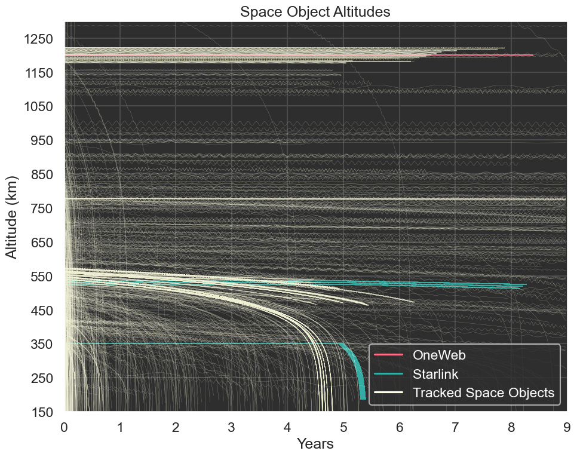

Welcome to FSPSim's documentation!
==================================

Motivation and Significance
---------------------------
FSPSim is a comprehensive tool designed to address the complexities and challenges of human space endeavors in the modern era.
Human space endeavors have expanded dramatically over the past decades. The rapid growth and potential impacts of satellite launches have led to the development of various models. FSPSim offers a transparent, configurable, and open-source solution, making source-sink evolutionary models more accessible.

Software Description
~~~~~~~~~~~~~~~~~~~~
FSPSim consists of various classes and modules:

- **The SpaceCatalogue Class:** Manages all SpaceObject instances.
- **The SpaceObject Class:** Represents an individual object in space.
- **The LaunchModel Module:** Transforms user predictions into SpaceObjects.
- **The Propagator Module:** Drives the propagation of all SpaceObjects.

.. figure:: ./_static/FSPSim_system_diag_v1.png
   :alt: Overview of FSPSim's architecture
   :align: center
   :width: 80%

Software Functionalities
~~~~~~~~~~~~~~~~~~~~~~~~
Users specify simulation parameters using a JSON file. The results are saved in a pickle file for further analysis.

Illustrative Examples
~~~~~~~~~~~~~~~~~~~~~
Users can generate various visualizations to analyze the simulation data. 

Current and Future Developments
~~~~~~~~~~~~~~~~~~~~~~~~~~~~~~~
Key areas of focus include refining the Launch Model and expanding the launch cost estimator.

Contents
--------
.. toctree::
   :maxdepth: 2

   fspsim
   fspsim.utils

Indices and tables
------------------
* :ref:`genindex`
* :ref:`modindex`
* :ref:`search`
